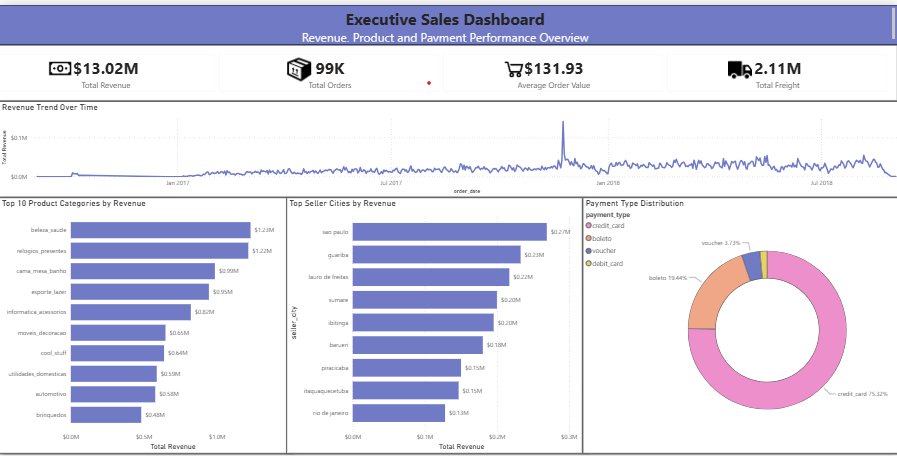
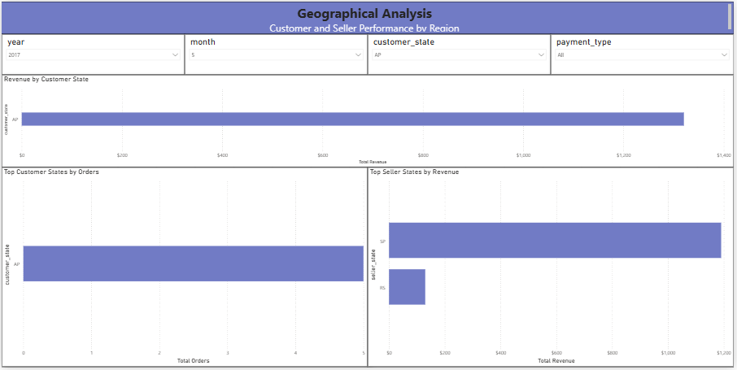

# E-Commerce Data Engineering Platform

## Architecture

## Executive Dashboard

## Geographical Analysis

## Project Overview

This project is an end-to-end ELT Data Engineering pipeline built using Python, PostgreSQL, Apache Airflow, Docker, and Power BI.

The pipeline follows the Medallion Architecture pattern:

* Bronze Layer: Raw data ingestion
* Silver Layer: Data cleaning and transformations
* Gold Layer: Analytical warehouse using Star Schema

The final analytical data is consumed through interactive Power BI dashboards.

---

## Tech Stack

* Python
* PostgreSQL
* Pandas
* Apache Airflow
* Docker
* Power BI
* Git & GitHub

---

## Architecture

Raw CSV Files
→ Bronze Layer
→ Silver Layer
→ Gold Layer
→ Power BI

Airflow orchestrates the pipeline and Docker provides containerized execution.

---

## Features

* End-to-End ELT Pipeline
* Medallion Architecture
* Incremental Loading using Watermarking
* Data Quality Checks
* Star Schema Data Warehouse
* Airflow DAG Orchestration
* Dockerized Environment
* Interactive Power BI Dashboards

---

## Data Warehouse Design

### Fact Table

* fact_orders

### Dimension Tables

* dim_customers
* dim_products
* dim_sellers
* dim_dates

---

## Dashboard Pages

### Executive Sales Dashboard

* Revenue KPI
* Orders KPI
* Average Order Value
* Freight Cost
* Revenue Trend
* Top Product Categories
* Top Seller Cities
* Payment Type Distribution

### Geographical Analysis

* Revenue by Customer State
* Top Customer States by Orders
* Top Seller States by Revenue

---

## Key Business Insights

* Credit Card is the dominant payment method.
* Revenue shows strong growth during peak sales periods.
* Product sales are concentrated among a small number of categories.
* Revenue contribution varies significantly across customer states.

---

## Future Improvements

* AWS Cloud Integration
* PySpark Transformations
* Kafka Streaming Pipeline
* Real-Time Analytics Dashboard

---

Built by Bhargavi as part of a Data Engineering Portfolio Project.
